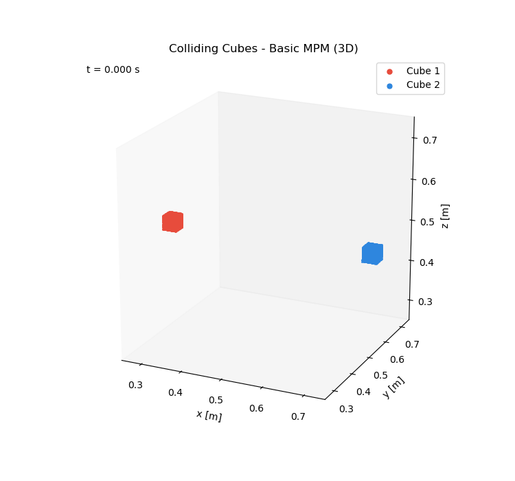

# 15763-mpm

Project proposal: A comparative study of recent improvements to the Material Point Method

Group member:

Korawich Kavee kkavee@andrew.cmu.edu

Lorene Wang lelinw@andrew.cmu.edu

Goal:
To evaluate and compare the performance, stability, and physical accuracy between MPM variants.

Course Website: https://www.cs.cmu.edu/~15763-s26/
